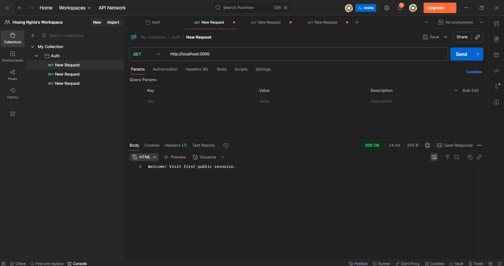
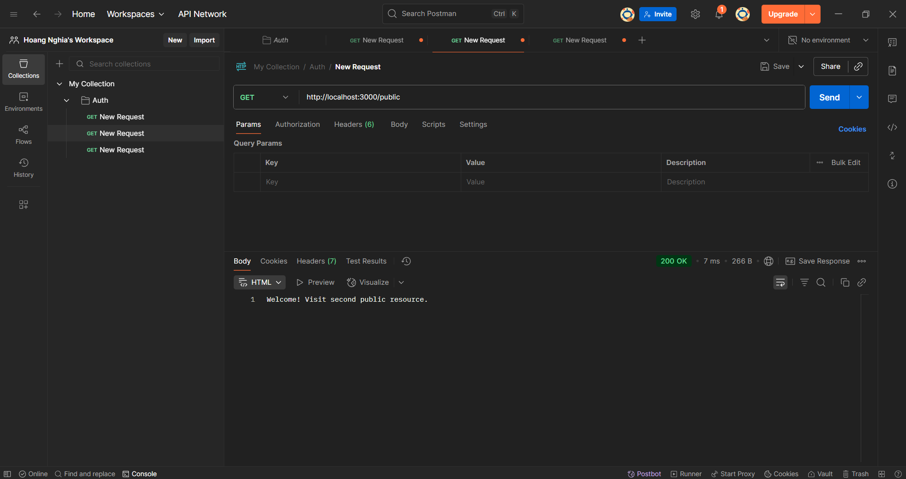
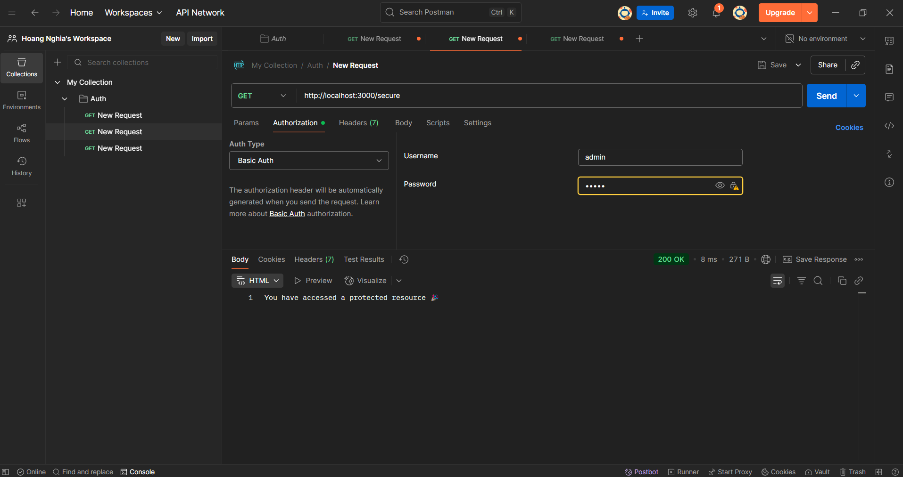
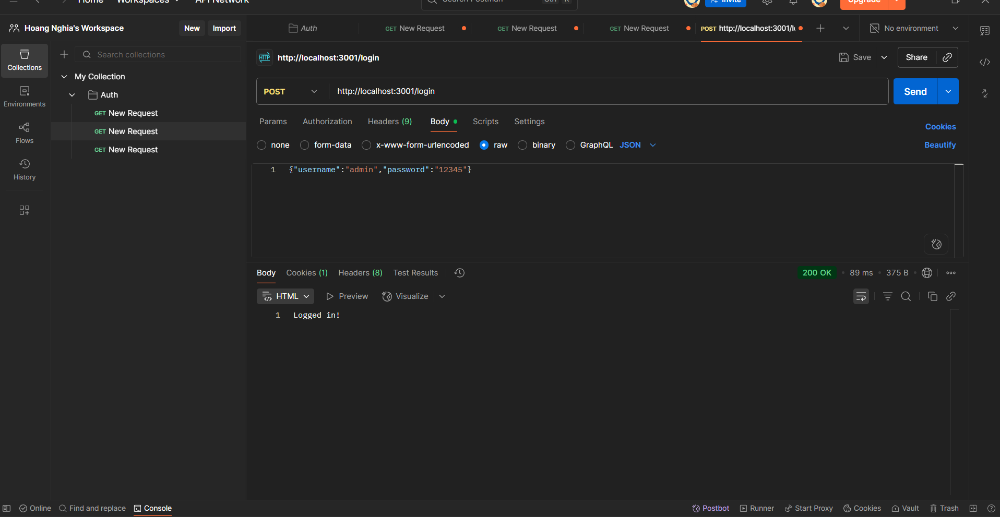
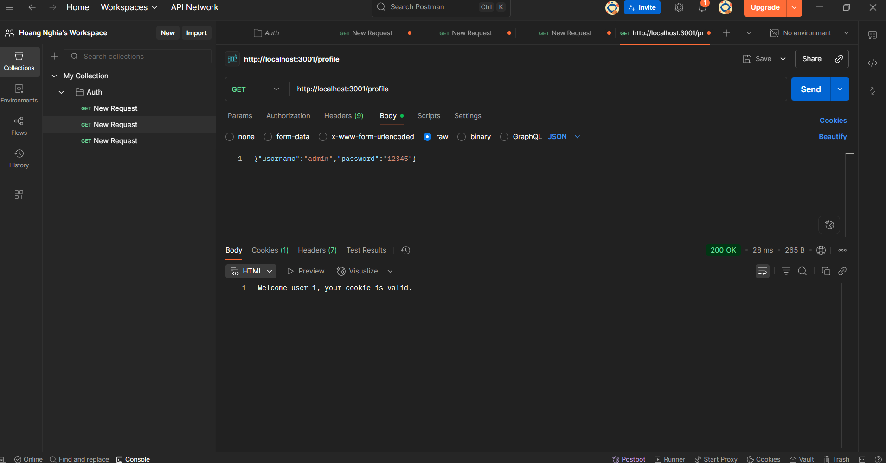
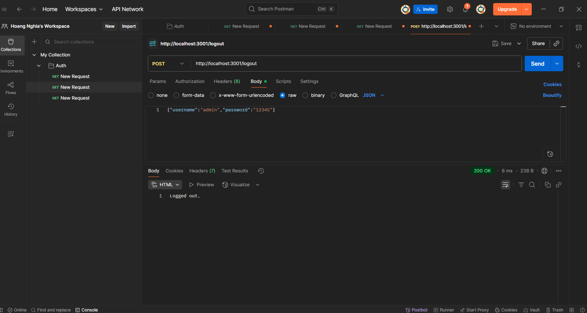

# Simple Auth

Demo of Basic and Cookie Authentication with Express.js.

## Setup
- Install MongoDB and run on `mongodb://127.0.0.1:27017`.
- Install dependencies: `npm install`.
- Run Basic Auth: `npm run start:basic` (port 3000).
- Run Cookie Auth: `npm run start:cookie` (port 3001).

## Testing with Postman

### 1. Basic Auth (node basic_auth.js)
- **Public**: GET http://localhost:3000/ → 200 OK.
  
- **Public**: GET http://localhost:3000/public → 200 OK.
  
- **Protected**: GET http://localhost:3000/secure
  - Authorization tab → Basic Auth → Username: admin, Password: 12345.
  - Expected: 200 OK, "You have accessed...".
  - No auth: 401. Wrong creds: 403.
  - Hint: Add Authorization field in request header.
  

### 2. Cookie Auth (node cookie_auth.js)
- **Login**: POST http://localhost:3001/login
  - Body (raw JSON): `{"username":"admin","password":"12345"}`.
  - Expected: 200 OK, "Logged in!".
  - Hint: Check Cookies tab for `auth_cookie_token`.
  
- **Profile**: GET http://localhost:3001/profile
  - Use cookie from login.
  - Expected: 200 OK, "Welcome user 1...".
  - No cookie: 401.
  
- **Logout**: POST http://localhost:3001/logout
  - Use cookie from login.
  - Expected: 200 OK, "Logged out.".
  - Hint: Check Cookies tab; `auth_cookie_token` should be cleared.
  
- **MongoDB**: 
  - Connect: `mongo`.
  - Use: `use cookieApp`.
  - Query: `db.cookies.find()` (see cookie after login, removed after logout or 5 mins).
  